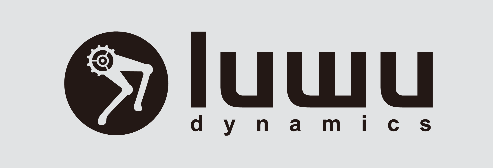

  

<h1 align="center">
  Welcome to the LuwuDynamics Open Source Community! 
  欢迎来到 LuwuDynamics 开源社区！
</h1>

---

At LuwuDynamics, we believe robotics should be intelligent, adaptive, and accessible. Our mission is to bridge the gap between cutting-edge dynamics research and real-world robotic applications — empowering developers, researchers, and makers to build the next generation of intelligent machines.

The open-source software here is developed and maintained by the LuwuDynamics team. These projects span the full robotics stack: from low-level motor control and kinematics to high-level motion planning, simulation, and AI-driven decision making. We are committed to transparency, collaboration, and delivering production-ready tools that you can rely on.

Although the majority of our software is published under open-source licenses, some components may be released under proprietary licenses. Please check the included `LICENSE` file in each repository for more details.

---

在 LuwuDynamics，我们相信机器人技术应当是智能、自适应且触手可及的。我们的使命是弥合前沿动力学研究与真实世界机器人应用之间的鸿沟——赋能开发者、科研人员和创客，共同打造下一代智能机器。

这里的所有开源软件均由 LuwuDynamics 团队开发与维护。项目覆盖完整的机器人技术栈：从底层电机控制与运动学，到高层运动规划、仿真模拟以及 AI 驱动的决策系统。我们致力于透明、协作，为你交付生产级可靠的工具。

尽管我们的大部分软件以开源协议发布，部分组件可能以专有许可发布。请查看各仓库中的 `LICENSE` 文件了解详情。

---

## 🚀 What We Build / 我们的核心技术

<table>
  <tr>
    <td>🦾 <b>Robot Kinematics</b> 机器人运动学</td>
    <td>Real-time forward and inverse kinematics solvers for serial manipulators, mobile platforms, and legged robots. 实时正逆运动学求解，支持串联机械臂、移动平台及足式机器人。</td>
  </tr>
  <tr>
    <td>🧠 <b>Motion Planning & Tracking</b> 运动规划与跟踪</td>
    <td>Path planning and trajectory tracking for robots operating in complex structured and unstructured environments. 路径规划与轨迹跟踪，适用于复杂结构化与非结构化环境下的机器人系统。</td>
  </tr>
  <tr>
    <td>🖥️ <b>Simulation Model Assets</b> 仿真模型资产</td>
    <td>Robot model files for major simulation platforms — including Gazebo, Isaac Sim, and MuJoCo — for rapid prototyping and validation. 提供 Gazebo、Isaac Sim、MuJoCo 等主流仿真平台的机器人模型文件，支持快速原型验证。</td>
  </tr>
  <tr>
    <td>⚙️ <b>Robot Middleware</b> 机器人中间件</td>
    <td>Cross-platform middleware with C and Python SDKs for secondary development — unified access to actuators, sensors, and embedded controllers. 跨平台通用中间件，提供 C / Python 二次开发接口，统一封装执行器、传感器与嵌入式控制器。</td>
  </tr>
  <tr>
    <td>📡 <b>Edge Perception</b> 边缘感知</td>
    <td>Compact perception models optimized for low-latency inference on edge hardware. 边缘端轻量化感知小模型，实现低延迟快速感知。</td>
  </tr>
</table>

---

## ✨ How You Can Contribute / 如何参与贡献

We value contributions and actively recognize our most engaged community members with public recognition, maintainer status, and exclusive LuwuDynamics gear. Here's how you can get involved:

我们珍视每一位贡献者，并积极表彰最活跃的社区成员，提供公开认可、维护者身份以及 LuwuDynamics 专属周边。以下是参与方式：

- 🐛 **Triage Open Issues** / **问题分类** — Help reproduce reported bugs, ask clarifying questions, spot duplicates, and improve issue descriptions. / 帮助复现 Bug、追问细节、标记重复问题、完善问题描述。
- 💻 **Submit Fixes & Features** / **提交修复与功能** — Pick an open issue or feature request, implement it, and submit a pull request. Check the `good first issue` label for beginner-friendly tasks. / 挑选开放 Issue 或功能需求，实现后提交 Pull Request。新手可从 `good first issue` 标签入手。
- 🧪 **Test Open Pull Requests** / **测试 PR** — Run proposed changes on your hardware or simulation setup and report your results. Real-world testing is invaluable to us. / 在你的硬件或仿真环境中运行待合并的改动并反馈结果。真实环境测试对我们至关重要。
- 👀 **Review Code** / **代码审查** — Help maintain quality by reviewing pull requests and suggesting improvements. / 通过审查 PR 和提出改进建议，帮助我们保持代码质量。
- 📖 **Write Documentation** / **撰写文档** — Improve tutorials, API docs, and examples. Clear documentation is just as important as clean code. / 完善教程、API 文档和示例。清晰的文档与整洁的代码同等重要。

---

## 📖 Explore More / 了解更多

| Resource / 资源 | Description / 描述 |
|---|---|
| 🌐 [Official Website / 官网](https://www.xgorobot.com) | Product info, use cases, and latest news / 产品信息、应用案例与最新动态 |
| 📚 [Wiki / 文档](https://wiki.xgorobot.com) | API references, getting-started guides, and tutorials / API 参考、入门指南与教程 |
| 💻 [IDE / 开发环境](https://ide.xgorobot.com) | Online development environment and code playground / 在线开发环境与代码实验场 |
| 💬 [Discord Community / Discord社区](https://discord.gg/pfWrJeJRh6) | Real-time chat, Q&A, and community collaboration / 实时聊天的问答、创意交流与社区协作 |

---

  © 2025 LuwuDynamics. Made with ❤️ by robotics enthusiasts worldwide. © 2025 LuwuDynamics. 由全球机器人爱好者用 ❤️ 打造。

